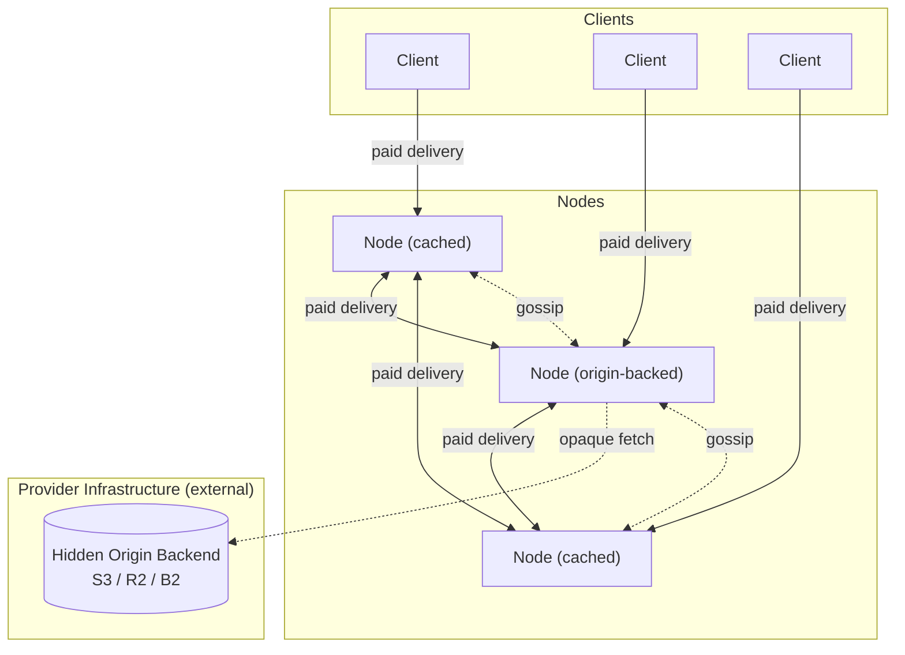

## System diagram

## Participant roles

| Role | Operated by | Participates in CDN? |
| --- | --- | --- |
| **Node (pure cache)** | Independent node operator | Yes — stakes, gossips, probes, delivers |
| **Node (origin-backed)** | Content provider *or* node operator with storage | Yes — same protocol, plus a private origin backend |
| **Client** | End-user or application | Pays for bytes; subscribes to gossip but does not publish |

See [Participants](/overview/participants) for a deeper breakdown per role.

## Life of a paid delivery

1. **Client bootstrap** — client generates a keypair, queries the on-chain registry, seeds a peer table, and subscribes to regional + global gossip topics.
2. **Discovery** — client probes its known peers for a blob hash. On miss, any peer performs a DHT lookup to locate holders.
3. **Selection** — returned candidates are scored by price, latency, and reputation; lowest cost wins.
4. **Payment channel open** — client opens a payment channel in an allowlisted ERC-20 with the selected node on-chain ([payments](/protocol/payments)).
5. **Streaming + vouchers** — node streams to the client; client signs off-chain vouchers as bytes flow.
6. **Cache-miss fan-out** — if the node doesn't have the blob, it pulls from another peer (paid). Every byte delivered in the network is paid.
7. **Channel close** — either party initiates settlement on-chain, with a dispute window for stale closes.

## Key invariants

- No external origin URL exists — content enters the network through origin-backed nodes whose backends are hidden.
- A node cannot earn without delivering verifiable bytes — hash mismatch voids payment.
- A node cannot join the mesh without staking — registration enforces a minimum stake before accepting the call.
- A node cannot register an identity it does not control — both keys must sign at registration.
- Safety bounds on all governable parameters are hardcoded — governance cannot set fees to 100% or stake to zero.
- A node cannot serve a blacklisted hash after the compliance window — doing so is slashable.

## Non-goals

- DRM or content protection
- Content transcoding or adaptive format conversion
- Search, discovery, or recommendation
- Mobile or web clients
- Erasure coding — full replication only
