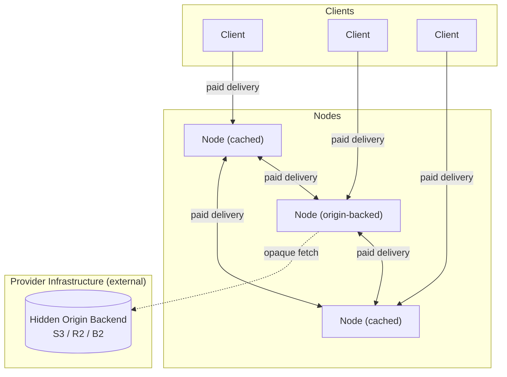

## System diagram

```mermaid
graph TD
    subgraph Nodes
        N1["Node (cached)"]
        N2["Node (origin-backed)"]
        N3["Node (cached)"]
    end

    subgraph Clients
        C1[Client]
        C2[Client]
        C3[Client]
    end

    subgraph "Provider Infrastructure (external)"
        S3[("Hidden Origin Backend<br/>S3 / R2 / B2")]
    end

    N1 <-->|"paid delivery"| N2
    N2 <-->|"paid delivery"| N3
    N1 <-->|"paid delivery"| N3

    C1 -->|"paid delivery"| N1
    C2 -->|"paid delivery"| N2
    C3 -->|"paid delivery"| N3

    N2 -.->|opaque fetch| S3
```

## Participant roles

| Role                     | Operated by                                      | Participates in CDN?                                                          |
| ------------------------ | ------------------------------------------------ | ----------------------------------------------------------------------------- |
| **Node (pure cache)**    | Independent node operator                        | Yes — bonds, probes, publishes to the DHT, delivers                           |
| **Node (origin-backed)** | Content provider _or_ node operator with storage | Yes — same protocol, plus authorization to serve as an origin for a namespace |
| **Client**               | End-user or application                          | Pays for bytes; reads the registry but holds no role                          |

See [Participants](/overview/participants) for a deeper breakdown per role.

## Life of a paid delivery

1. **Client bootstrap** — client generates a keypair, queries the on-chain registry for the active node set, and caches it.
2. **Discovery** — a DHT lookup locates holders of the blob hash, and a parallel probe confirms which of them will actually serve the wanted range, at what rate and latency.
3. **Selection** — returned candidates are scored by price, latency, and reputation into one selection score; the lowest score wins, so a cheap or nearby node can outrank a better-reputed one.
4. **Payment** — the client pays from a USDC pool it opened once, off the fetch path, and reuses for every node ([payments](/protocol/payments)).
5. **Streaming + vouchers** — node streams to the client; client signs a cumulative voucher and, on an optional hash chain, releases one preimage per 1 MiB chunk as bytes flow.
6. **Cache-miss fan-out** — if the node doesn't have the blob, it pulls from other holders (paid). Every byte delivered in the network is paid.
7. **Redemption** — the node redeems its own vouchers on-chain whenever it likes; the owner closes the pool to reclaim the unspent remainder.

## Key invariants

- No external origin URL exists — content enters the network through origin-backed nodes whose backends are hidden.
- A node cannot earn without delivering verifiable bytes — hash mismatch voids payment.
- A node cannot join the mesh without bonding — registration enforces a capacity bond (`bond = k × Mbps^α`) scaled to declared bandwidth, rather than a flat minimum.
- A node cannot register an identity it does not control — both keys must sign at registration.
- Safety bounds on all governable parameters are hardcoded — governance cannot set fees to 100% or push the operator revenue share below its floor.
- Being recognized as an origin is gated on-chain — governance vets a publisher wallet, and the vetted publisher seats its own origin operators per namespace. Configuring an origin backend locally without being seated means the node's bytes are served only as cache.
- A node cannot serve a blacklisted hash after the compliance window — doing so is slashable.

## Non-goals

- DRM or content protection
- Content transcoding or adaptive format conversion
- Search, discovery, or recommendation
- Mobile or web clients
- Erasure coding — full replication only
- Multi-chain settlement — a single L2
