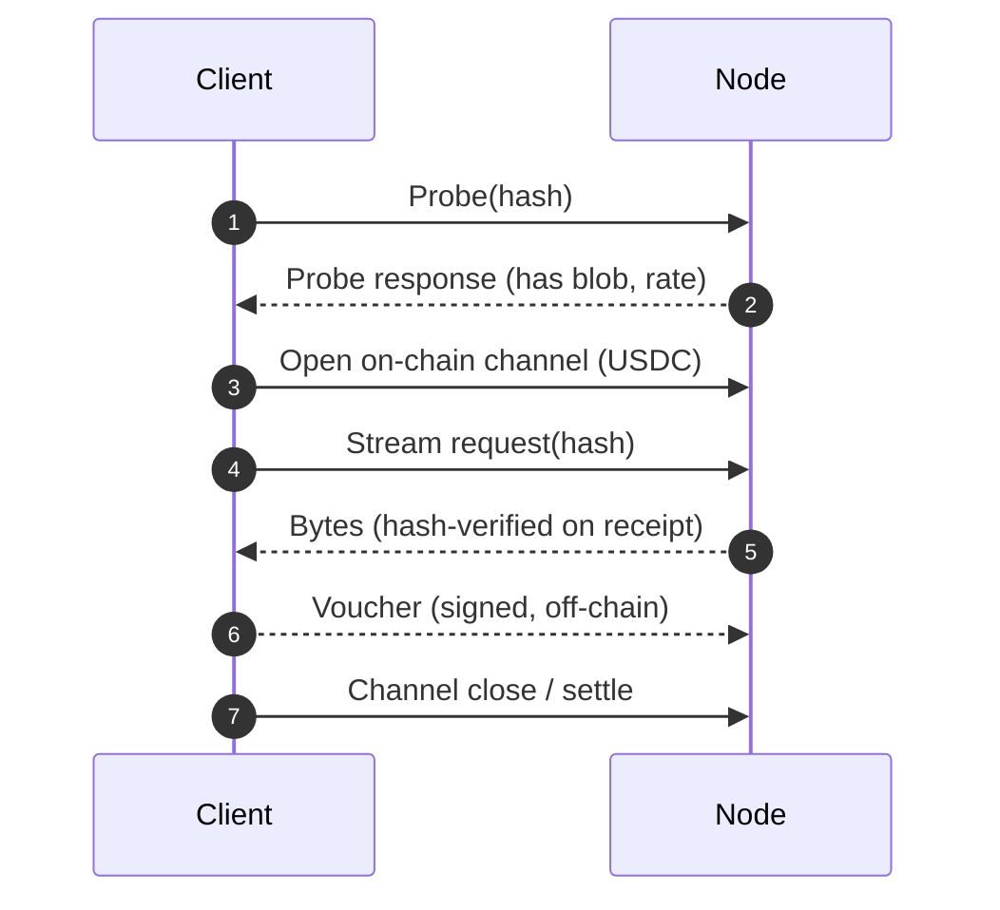
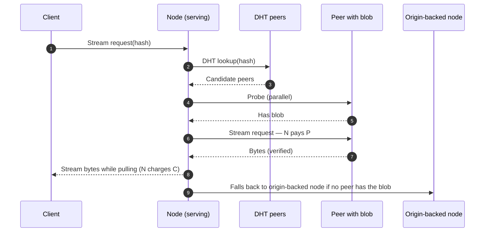

## Cache hit

The client picks the candidate with the best combination of price, latency, and reputation. After settling on a node, it opens a channel in an allowlisted ERC-20 and streams. Vouchers cover every byte delivered; the node can settle any voucher on-chain later.

## Cache miss with pull-through

Paid delivery is one protocol — used both client→node and node→node. Every byte of the node-to-node pull is paid by the serving node, which amortizes that cost across many downstream client deliveries.

If pull-through is disabled in the node's config, the node returns a redirect pointing to a peer (never an origin URL). The client opens a channel with that peer directly.

## Payment channels in three lines

1. **Open** — client opens a channel on-chain. Deposit is escrowed in the `PaymentChannel` contract.
2. **Vouchers** — off-chain signed messages updating the cumulative amount owed. Cadence is negotiable per stream.
3. **Close** — either party submits the latest voucher on-chain. A dispute window lets the counterparty submit a later-nonce voucher if the close is stale.

## What keeps the network honest

- **Hash verification.** Clients verify every chunk against the known blob hash. A bad byte voids payment.
- **On-chain evidence.** Protocol messages are signed in a form that can be verified on-chain as evidence of corrupted delivery, phantom announcements, rate manipulation, or blacklist violations ([slashing](/protocol/slashing)).
- **Challenge-response.** Submit evidence; the counterparty has a window to submit counter-evidence. The on-chain judge adjudicates after the window.
- **Reputation.** A 0.0–1.0 score combining direct experience and signed gossip from staked nodes ([reputation](/protocol/reputation)).
- **Content blacklist.** Governance-managed on-chain hash blacklist. Serving a blacklisted hash after the compliance window is slashable ([takedown](/protocol/takedown)).

## Where the boundary sits

| Layer | Trust |
| --- | --- |
| Bytes delivered | **Verified** against known hash |
| Node availability | Trusted — slashed if phantom-announced |
| Node rate honesty | Trusted — slashed if advertised rate contradicts charged rate |
| Origin backend correctness | **Assumed** — outside protocol scope (operator concern) |
| L2 RPC provider honesty | **Assumed** — mitigated via multi-source bootstrap |

See [privacy](/protocol/privacy) for the adversary model.
