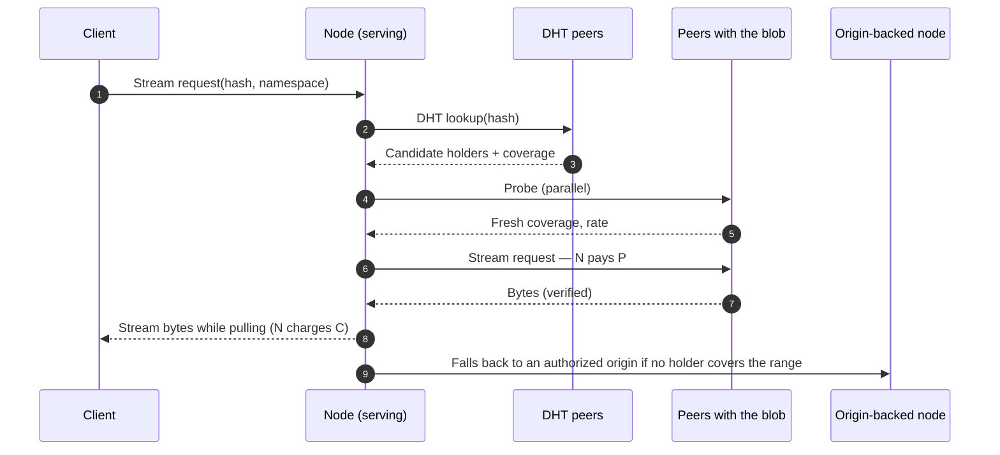

## Cache hit

```mermaid
sequenceDiagram
    autonumber
    participant C as Client
    participant N as Node
    participant P as PaymentPool (on-chain)

    C->>N: Probe(hash)
    N-->>C: Probe response (rate signed; coverage unsigned)
    C->>N: Stream request(hash, namespace)
    N-->>C: Bytes (hash-verified on receipt)
    C-->>N: Voucher (signed, cumulative)
    C-->>N: Preimage per MiB delivered
    N->>P: Redeem (voucher + preimage)
```

The client picks the candidate with the best combination of price, latency, and reputation. It pays from a pool it opened once and reuses for every node, so nothing on this path touches the chain until the node chooses to redeem. Vouchers cover every byte delivered.

## Cache miss with pull-through

```mermaid
sequenceDiagram
    autonumber
    participant C as Client
    participant N as Node (serving)
    participant D as DHT peers
    participant P as Peers with the blob
    participant O as Origin-backed node

    C->>N: Stream request(hash, namespace)
    N->>D: DHT lookup(hash)
    D-->>N: Candidate holders + coverage
    N->>P: Probe (parallel)
    P-->>N: Fresh coverage, rate
    N->>P: Stream request — N pays P
    P-->>N: Bytes (verified)
    N-->>C: Stream bytes while pulling (N charges C)
    N->>O: Falls back to an authorized origin if no holder covers the range
```

Paid delivery is one protocol — used both client→node and node→node. Every byte of the node-to-node pull is paid by the serving node, which amortizes that cost across many downstream client deliveries. The pull is **demand-windowed**: the node fills only far enough ahead of what its client has consumed and paid for, so a client that abandons at half leaves the node holding the demanded prefix rather than the whole blob.

A node may also simply decline. Refusing is not a protocol violation and is not slashable: if the upstream price doesn't clear the margin on the resale, serving at a loss is the wrong move for the operator and the client re-routes to another provider, paying only a latency cost.

## Multi-source parallel fetch

For a large blob, the client doesn't pull from a single node. A client-side scheduler admits a set of holders — **full and partial holders alike**, ranked by the same selection score, at most one node per operator — and fans out to all of them at once, up to `max_sources` (default 4, above a 64 MiB size floor).

Assignment follows **coverage**: discovery and probes carry a bitmap of which 64 MiB blocks each holder will serve, so each block goes to a holder that already has it. A block no admitted holder covers is a genuine gap, warmed once from origin — and that warmer's new coverage becomes discoverable supply for the next fetch.

Assignment is dynamic. When a source finishes its **segment**, it steals the largest remaining one from a peer, splitting it on a verifiable boundary; every segment is verified as it lands, and a stalled or failed source's _unfinished remainder_ is reassigned without restarting the download. There is deliberately no hedging — racing a segment against idle sources would mean paying for the copies that lose, so the tail is bounded by deadline-based reassignment instead. Aggregate throughput therefore scales with the number of admitted sources rather than any one holder's uplink.

There is no new wire surface — each source is just an ordinary paid stream, so pools, vouchers, and slashing work exactly as in the single-source paths above. Every source draws on the client's one pool, on its own independent lane.

## Payments in four lines

1. **Open** — the payer escrows one USDC deposit in the `PaymentPool` contract. Once, off the fetch path, reused for every node.
2. **Delegate** — the owner signs capped, expiring capabilities for whichever keys may spend from the pool. One capability is valid at every node.
3. **Meter** — a signed cumulative voucher anchors the amount owed, and an optional hash chain advances it by one 1 MiB **payment chunk** per released preimage, with no further signature. A voucher opening no chain is sealed at the amount it signs.
4. **Redeem** — the node settles its own vouchers on-chain whenever it likes; the owner closes the pool to reclaim the remainder, after a grace window that lets nodes redeem first.

## What keeps the network honest

- **Hash verification.** Clients verify every chunk group against the known blob hash as it arrives. A bad byte voids payment for that window.
- **On-chain evidence.** Probe and stream responses are signed in a form verifiable on-chain, as evidence of rate manipulation or blacklist violations ([slashing](/protocol/slashing)).
- **Synchronous adjudication.** The on-chain judge verifies revealed evidence and slashes on the spot, with no counter-evidence window. Challenges commit before they reveal, so the challenger reward cannot be front-run.
- **Reputation.** A local 0.0–1.0 score, built from a node's own delivery outcomes and nothing else ([reputation](/protocol/reputation)).
- **Content blacklist.** Governance-managed on-chain hash blacklist. Serving a blacklisted hash after the compliance window is slashable ([takedown](/protocol/takedown)).

## Where the boundary sits

| Layer                      | Trust                                                         |
| -------------------------- | ------------------------------------------------------------- |
| Bytes delivered            | **Verified** against known hash                               |
| Node availability          | Not trusted — a node may decline; the client re-routes        |
| Node rate honesty          | Trusted — slashed if the charged rate contradicts its quote   |
| Node region claim          | Self-attested — penalized in selection when latency disagrees |
| Origin backend correctness | **Assumed** — outside protocol scope (operator concern)       |
| L2 RPC provider honesty    | **Assumed** — mitigated via multiple independent providers    |

See [privacy](/protocol/privacy) for the adversary model.
