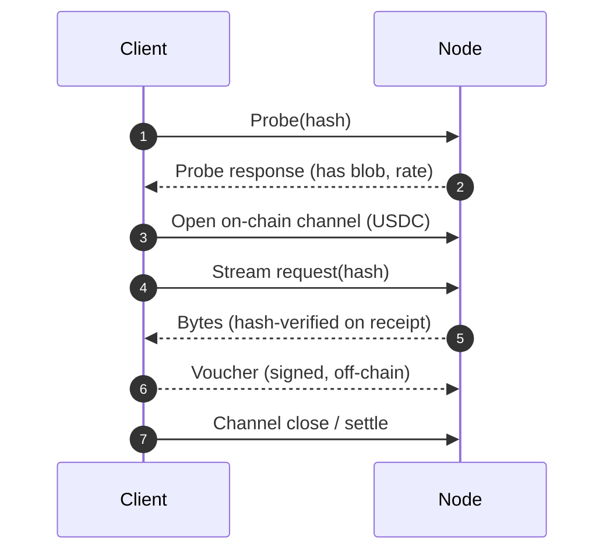
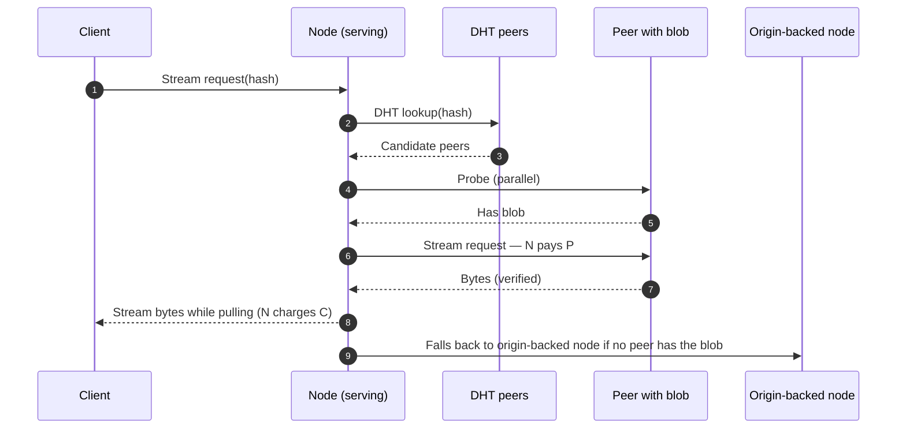

## Cache hit

```mermaid
sequenceDiagram
    autonumber
    participant C as Client
    participant N as Node

    C->>N: Probe(hash)
    N-->>C: Probe response (has blob, rate)
    C->>N: Open on-chain channel (USDC)
    C->>N: Stream request(hash)
    N-->>C: Bytes (hash-verified on receipt)
    C-->>N: Voucher (signed, off-chain)
    C->>N: Channel close / settle
```

The client picks the candidate with the best combination of price, latency, and reputation. After settling on a node, it opens a USDC channel and streams. Vouchers cover every byte delivered; the node can settle any voucher on-chain later.

## Cache miss with pull-through

```mermaid
sequenceDiagram
    autonumber
    participant C as Client
    participant N as Node (serving)
    participant D as DHT peers
    participant P as Peer with blob
    participant O as Origin-backed node

    C->>N: Stream request(hash)
    N->>D: DHT lookup(hash)
    D-->>N: Candidate peers
    N->>P: Probe (parallel)
    P-->>N: Has blob
    N->>P: Stream request — N pays P
    P-->>N: Bytes (verified)
    N-->>C: Stream bytes while pulling (N charges C)
    N->>O: Falls back to origin-backed node if no peer has the blob
```

Paid delivery is one protocol — used both client→node and node→node. Every byte of the node-to-node pull is paid by the serving node, which amortizes that cost across many downstream client deliveries.

If pull-through is disabled in the node's config, the node returns a redirect pointing to a peer (never an origin URL). The client opens a channel with that peer directly.

## Multi-source parallel fetch

For a large blob, the client doesn't pull from a single node. A client-side scheduler splits the blob across several sources at once — full holders only for now — up to `max_sources` (a configurable cap on parallel sources). Each source is assigned bao-aligned **work units** (byte ranges the bao decoder can verify on their own).

Assignment is dynamic: fast sources steal work from slow ones, every unit is verified as it lands, a failed unit is re-dispatched to another source, and the last few stragglers are hedged across sources so one slow peer can't stall completion. Aggregating parallel streams lets a blob be delivered at multi-gigabit speeds once it's cached across enough full holders — no single origin's uplink caps the transfer.

There is no new wire surface — each source is just an ordinary paid `cdn/client/v1` stream, so channels, vouchers, and slashing work exactly as in the single-source paths above.

## Payment channels in three lines

1. **Open** — client opens a channel on-chain. Deposit is escrowed in the `PaymentChannel` contract.
2. **Vouchers** — off-chain signed messages updating the cumulative amount owed. Cadence is negotiable per stream.
3. **Close** — either party submits the latest voucher on-chain. A dispute window lets the counterparty submit a later-nonce voucher if the close is stale.
4. **Cooperative close (fast path)** — when both parties are online and agree, a single co-signed transaction settles the channel immediately with no dispute window, falling back to the standard close if either side declines.

## What keeps the network honest

- **Hash verification.** Clients verify every chunk against the known blob hash. A bad byte voids payment.
- **On-chain evidence.** Protocol messages are signed in a form that can be verified on-chain as evidence of phantom announcements, rate manipulation, or blacklist violations ([slashing](/protocol/slashing)).
- **Synchronous adjudication.** The on-chain judge verifies submitted evidence and slashes on the spot, with no counter-evidence window.
- **Reputation.** A 0.0–1.0 score combining direct experience and signed gossip from staked nodes ([reputation](/protocol/reputation)).
- **Content blacklist.** Governance-managed on-chain hash blacklist. Serving a blacklisted hash after the compliance window is slashable ([takedown](/protocol/takedown)).

## Where the boundary sits

| Layer                      | Trust                                                         |
| -------------------------- | ------------------------------------------------------------- |
| Bytes delivered            | **Verified** against known hash                               |
| Node availability          | Trusted — slashed if phantom-announced                        |
| Node rate honesty          | Trusted — slashed if advertised rate contradicts charged rate |
| Origin backend correctness | **Assumed** — outside protocol scope (operator concern)       |
| L2 RPC provider honesty    | **Assumed** — mitigated via multi-source bootstrap            |

See [privacy](/protocol/privacy) for the adversary model.
