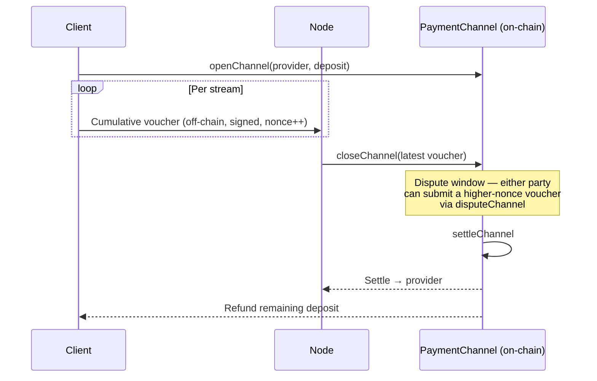

## Decision

Clients pay nodes **per MB** over off-chain **payment channels** settled on-chain. All channels are denominated in **USDC**, fixed at contract deployment. On a cache miss, nodes pay peers per MB for initial content pulls, then amortize that cost across many client deliveries. Origin-backed nodes set the effective price ceiling (their backend egress costs). Rates are fully market-driven within governance-set bounds.

## Channel lifecycle

The channel token is fixed (USDC) at deployment, so `openChannel` takes only the provider and deposit. Close is a three-step lifecycle — `closeChannel` (callable by either party) starts the dispute window, `disputeChannel` accepts a higher-nonce voucher during the window, and `settleChannel` distributes funds after it expires. A node may also `withdraw` accrued earnings against the latest voucher while the channel stays open — redeeming a monotonic client-signed claim needs no dispute window.

## Vouchers

Off-chain signed messages bound to a specific channel, carrying a strictly increasing **nonce** (starting at 1) and a **cumulative** amount and byte count. Each new voucher restates the running total owed — both amount and bytes are monotonically non-decreasing — and the highest-nonce voucher is the one that settles. Nodes persist the latest nonce rather than discarding older state, since `disputeChannel` only accepts a strictly higher nonce. Cadence is negotiated per stream.

## Rate discovery

Each node advertises its own per-MB rate. Governance sets rate bounds (in USDC); a node advertising outside the bounds is ignored by selection. Rates can change between streams.

## Dispute window

A window after `closeChannel` during which either party can submit a later (higher-nonce) voucher via `disputeChannel` if a stale close was filed. Default 48 hours, governable within 12h–72h.
