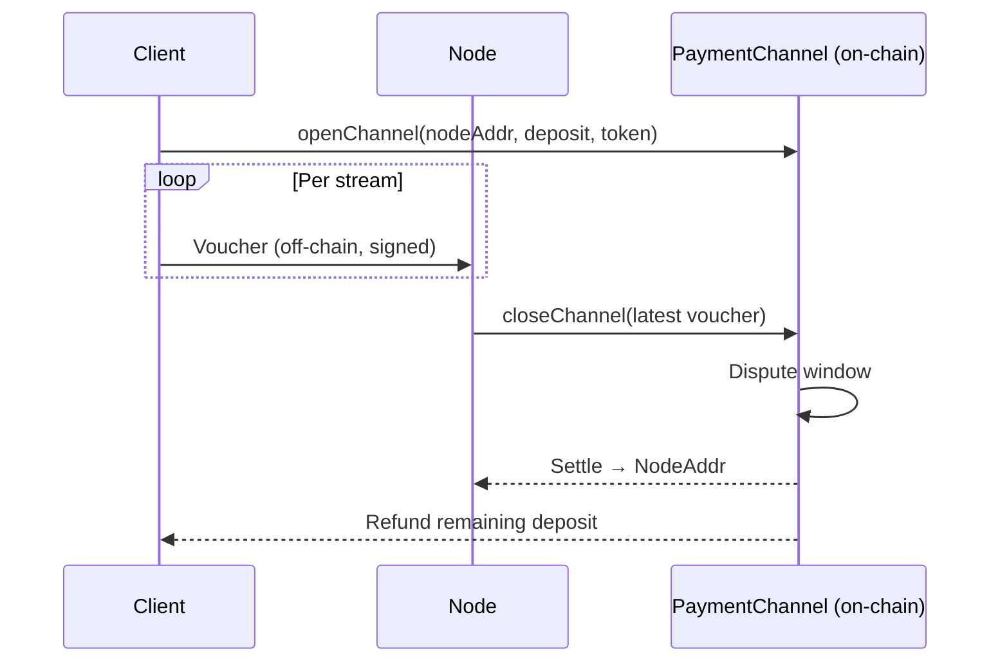

## Decision

Clients pay nodes **per MB** over off-chain **payment channels** settled on-chain. On a cache miss, nodes pay peers per MB for initial content pulls, then amortize that cost across many client deliveries. Origin-backed nodes set the effective price ceiling (their backend egress costs). Rates are fully market-driven within governance-set bounds.

## Channel lifecycle

## Vouchers

Off-chain signed messages bound to a specific channel. Each voucher supersedes prior ones in the same channel — at settlement only the highest-value voucher matters, so nodes can safely discard older ones. Cadence is negotiated per stream.

## Rate discovery

Each node advertises its own per-MB rate. Governance sets per-token bounds; a node advertising outside the bounds is ignored by selection. Rates can change between streams.

## Dispute window

A close window during which the counterparty can submit a later voucher if a stale-nonce close was filed. Bounded by governance.
