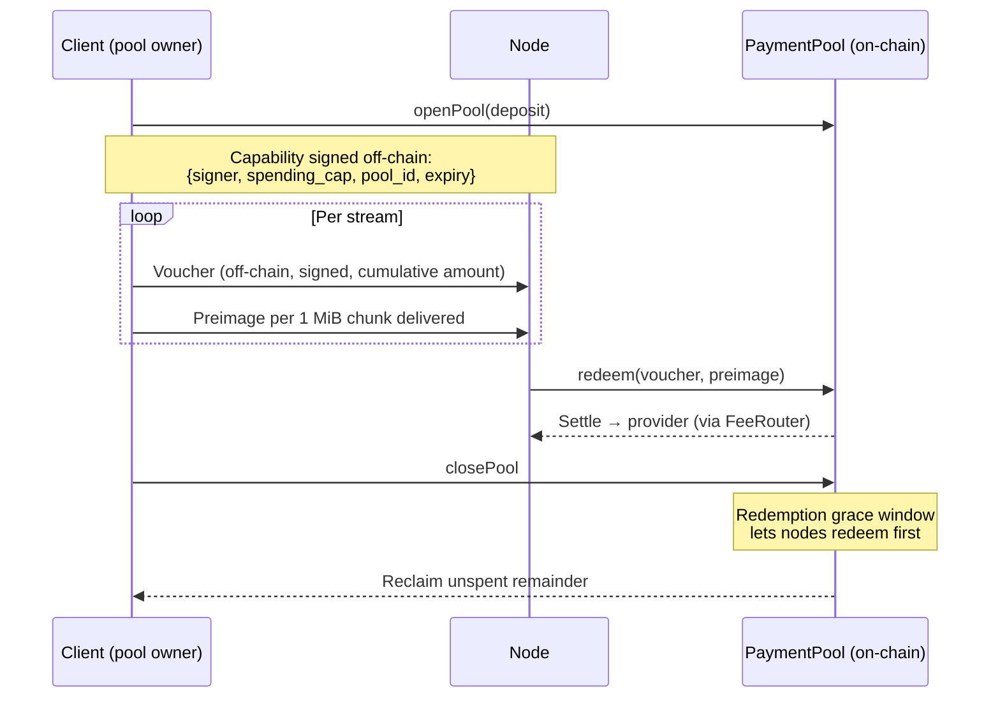

## Decision

Clients pay nodes **per MB** with off-chain **vouchers backed by a shared on-chain pool**. All pools are denominated in **USDC**, fixed at contract deployment. On a cache miss, nodes pay peers per MB for content pulls, then amortize that cost across many client deliveries. Origin-backed nodes set the effective price ceiling (their backend egress costs). Rates are otherwise fully market-driven, above a governance-set floor.

One funded pool backs payments from **many capped signers** to **many nodes**. There is no channel per node and no channel per client: the owner opens a pool once, reuses it, and closes it to reclaim the unspent remainder.

## Pool lifecycle


```mermaid
sequenceDiagram
    participant C as Client (pool owner)
    participant N as Node
    participant P as PaymentPool (on-chain)

    C->>P: openPool(deposit)
    Note over C,N: Capability signed off-chain:<br/>{signer, spending_cap, pool_id, expiry}
    loop Per stream
        C->>N: Voucher (off-chain, signed, cumulative amount)
        C->>N: Preimage per 1 MiB chunk delivered
    end
    N->>P: redeem(voucher, preimage)
    P-->>N: Settle → provider (via FeeRouter)
    C->>P: closePool
    Note over P: Redemption grace window<br/>lets nodes redeem first
    P-->>C: Reclaim unspent remainder
```

`openPool` happens **once and off the fetch path**, so it is not latency-critical; `topUp` refills a pool that has been drawn down. A node redeems whenever it likes while the pool is open — redeeming a signed, monotone claim needs no dispute window. The owner closes the pool to reclaim what is left, after a **redemption grace window** (48 hours by default, governable within 48h–72h) during which nodes settle outstanding vouchers.

## Capabilities

The pool owner authorizes each voucher signer with an off-chain **capability** signed over `{signer, spending_cap, pool_id, expiry}`. It is **node-agnostic** — one capability is valid at every node — and it is registered on-chain once, on that signer's first redemption.

Delegation bounds the damage a compromised key does: `spending_cap` bounds what the key can authorize, `expiry` retires it if the owner doesn't renew. The owner keeps sole control of top-up and close. A single user makes its own key the sole signer; a client fanning out to per-device or per-session keys issues each a small capped capability from one pool.

The sum of the caps may exceed the deposit. Nodes keep a pool solvent by reserving a refundable minimum remaining balance and stopping service before the pool reaches it.

## Vouchers

Off-chain signed messages over `{pool_id, signer, provider, amount, bytes_delivered, chain_root, chunk_price}`. Two properties matter:

- **Node-addressed.** The voucher names its payee, so one node cannot redeem a voucher meant for another and each node keeps its own independent ordering.
- **Cumulative.** `amount` is a settlement anchor that only moves up. A re-submitted voucher pays zero; there is no nonce and no dispute window.

## Hash-chain metering

Between signatures, delivery is metered by a **hash chain** rather than a new signature per interval. The payer commits the chain's root in the voucher and, after verifying each delivered chunk, releases the next **preimage** down the chain. The node hashes that preimage forward until it reaches a value it already trusts.

Redemption resolves both objects with one formula:

```text
claimed = amount + chain_index × chunk_price
```

A preimage is self-proving — nobody derives a deeper one without the seed — so accepting a tick costs one hash, with no signature, no round trip and nothing to persist before the next chunk ships. Signatures are therefore O(1) per transfer rather than one per interval.

The payment quantum is the **payment chunk**: `chunk_bytes` = **1 MiB (1,048,576 bytes)**, a protocol constant that nothing negotiates and no message carries. A released preimage has to be worth the same to payer and node, and a fixed constant removes that disagreement instead of negotiating it away. The protocol's **MB is that same 1,048,576 bytes**, so a chunk costs exactly the node's advertised `rate_per_mb` with no rounding at any rate — `chunk_price` is just that quoted rate, signed into the voucher, and a node rejects any voucher whose signed `chunk_price` does not match its own quote.

## Credit window

Payments from one signer to one node out of one pool form a **lane**: an independent running total, with its own watermark and its own chain. A node's exposure on a lane is bounded by a **credit window** — the unpaid balance it will carry before it pauses — not by the meter's resolution. The window starts at a floor and ramps as the lane pays, so a new payer proves itself on small credit before a node extends more.

## Rate discovery

Each node advertises its own per-MB rate, quoted in every signed probe response. Governance sets a **floor**, not a ceiling: a node whose configured rate falls below the current floor raises its quote to the floor and logs a warning rather than refusing to serve, and redemption clamps the byte credit on any voucher priced under it. No governance ceiling caps a node's rate from above: the buyer sees the signed rate before it pays anything, which is what makes a ceiling unnecessary. A requester rejecting an expensive quote is local policy rather than a protocol rule. A quoted rate is binding for any stream opened inside the [slashing window](/protocol/slashing#the-slashing-window).

## Minimum deposit

`openPool` enforces a governance-set `minDeposit` on the credited deposit. It is a Sybil knob: the per-pool solvency floor bounds loss within one pool, and an attacker escapes it by fanning out across many pools, so the floor taxes the capital locked in simultaneous pools. Deposits stay fully refundable, and the parameter is bounded at **0 to $100** — zero leaves it dormant, and the ceiling keeps governance from pricing small honest buyers out of opening a pool.
